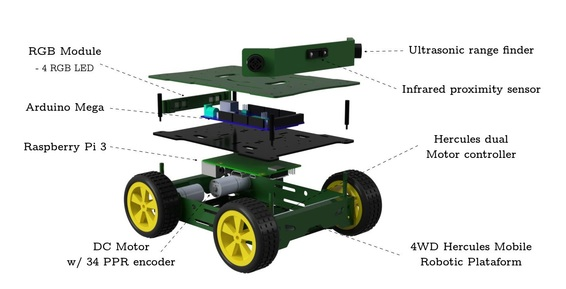
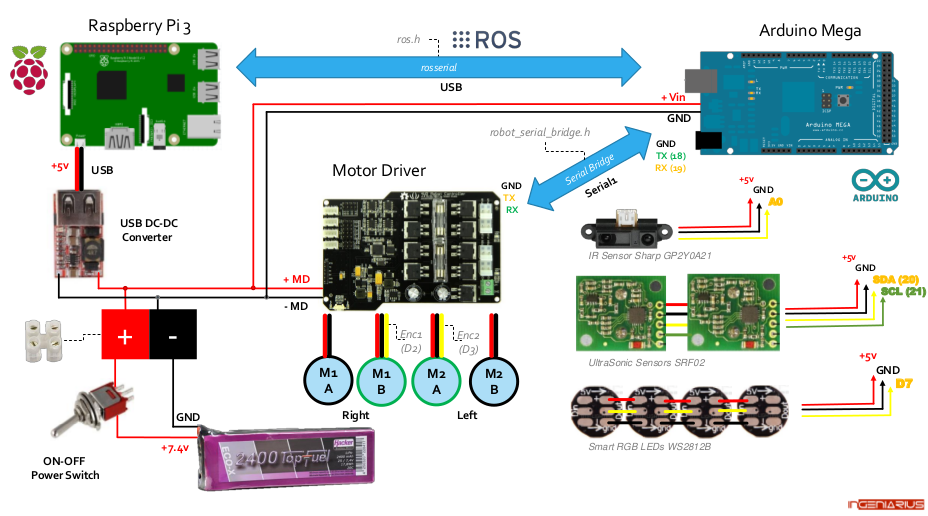
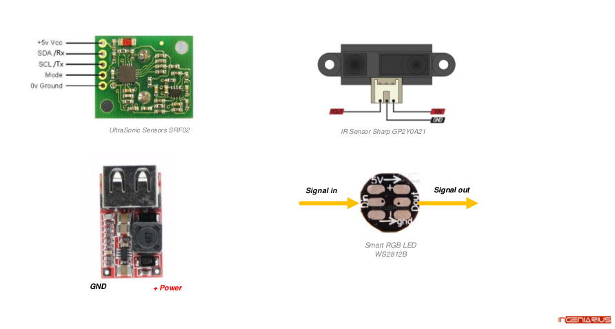
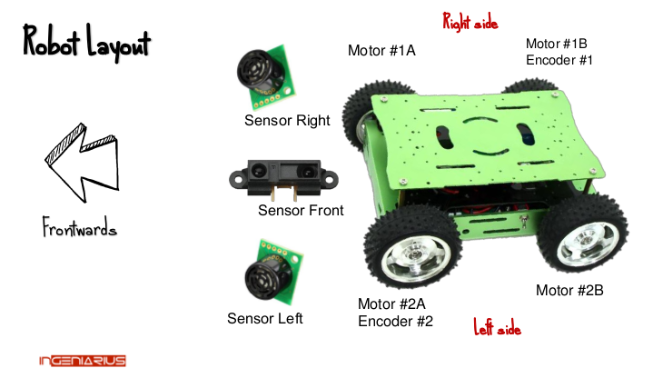
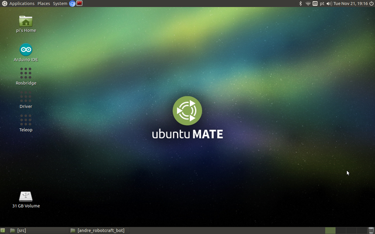
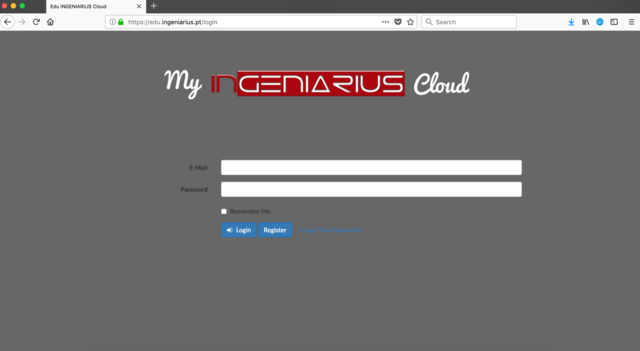
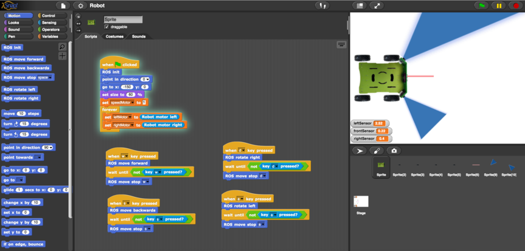

# Overview
* [1. RobotCraft Bot](https://github.com/ingeniarius-ltd/robotcraft_bot/blob/master/README.md#1.-RobotCraft-Bot)
* [2. Features](https://github.com/ingeniarius-ltd/robotcraft_bot/blob/master/README.md#2.-Features)
* [3. Hardware](https://github.com/ingeniarius-ltd/robotcraft_bot/blob/master/README.md#3.-Hardware)
* * [3.1. Robot Explode View](https://github.com/ingeniarius-ltd/robotcraft_bot/blob/master/README.md##3.1-Robot-Explode-View)
* * [3.2. Datasheet](https://github.com/ingeniarius-ltd/robotcraft_bot/blob/master/README.md##3.2-Datasheet)
* * [3.3. Robot Layout](https://github.com/ingeniarius-ltd/robotcraft_bot/blob/master/README.md##3.2-Robot-Layout)
* [4. GetStarted](https://github.com/ingeniarius-ltd/robotcraft_bot/blob/master/README.md#4.-Get-Started)
* * [4.1. How to configure wifi access](https://github.com/ingeniarius-ltd/robotcraft_bot/blob/master/README.md##4.1.-How-to-configure-wifi-access)
* * [4.1.1. Local access by HDMI Cable](https://github.com/ingeniarius-ltd/robotcraft_bot/blob/master/README.md###4.1.1.-Local-access-by-HDMI-Cable)
* * [4.1.2. Local access by ethernet cable](https://github.com/ingeniarius-ltd/robotcraft_bot/blob/master/README.md###4.1.2.-Local-access-by-ethernet-cable)
* * [4.2. Remote access by NoMachine](https://github.com/ingeniarius-ltd/robotcraft_bot/blob/master/README.md##4.2.-Remote-access-by-NoMachine)
* * [4.3. Remote access by SSH](https://github.com/ingeniarius-ltd/robotcraft_bot/blob/master/README.md##4.3.-Remote-access-by-SSH)
* [5. Repository Overview](https://github.com/ingeniarius-ltd/robotcraft_bot/blob/master/README.md#5.-Repository-Overview)
* [6. ROS Integration (High-Level)](https://github.com/ingeniarius-ltd/robotcraft_bot/blob/master/README.md#6.-ROS-Integration-(High-Level))
* * [6.1. Published Topics](https://github.com/ingeniarius-ltd/robotcraft_bot/blob/master/README.md##6.1.-Published-Topics)
* * [6.2. Subscribed topics](https://github.com/ingeniarius-ltd/robotcraft_bot/blob/master/README.md##6.2.-Subscribed-topics)
* * [6.3. tf transforms provided](https://github.com/ingeniarius-ltd/robotcraft_bot/blob/master/README.md##6.3.-tf-transforms-provided)
* [7. Ingeniarius Cloud (Snap)](https://github.com/ingeniarius-ltd/robotcraft_bot/blob/master/README.md#7.-Ingeniarius-Cloud-(Snap))
* * [7.1. Account Register, Login and Snapp-Ingeniarius](https://github.com/ingeniarius-ltd/robotcraft_bot/blob/master/README.md##7.1.-Account-Register,-Login-and-Snapp-Ingeniarius)
* * [7.2. Snap Ingeniarius example](https://github.com/ingeniarius-ltd/robotcraft_bot/blob/master/README.md##7.2.-Snap-Ingeniarius-example)
* [8. Support](https://github.com/ingeniarius-ltd/robotcraft_bot/blob/master/README.md#8.-Support)

# 1. RobotCraft Bot


[Ingeniarius Store](https://store.ingeniarius.pt/)

[RobotCraft Bot](https://store.ingeniarius.pt/)  is a limited edition of mobile robots constructed during the 2nd Robotics Craftsmanship International Academy ([RobotCraft 2017](https://youtu.be/8kowPQPkloY)).

This robot is based in the Hercules platform, benefiting from the same Arduino-compatible motor controller that can consistently support the current up to 15A and driving voltage in the range of 6V-20V. Nevertheless, this robot additional includes an Arduino Mega board so that the platform can be easily controlled using a PID controller and the 34 PPR encoders. The Arduino firmware (available as download) also allows to control 4 Smart RGB LEDs WS2812B and read measurements taken from 2 Devantech SRF02 ultrasonic range finder and 1 Sharp GP2Y0A21YK infrared proximity sensor.

[](https://youtu.be/T9cAixLaW-8)


# 2. Features


A Raspberry Pi 3 for high-level control, with [Ubuntu MATE 16.04 LTS](https://ubuntu-mate.org/blog/ubuntu-mate-xenial-final-release/) installed do the honours by running the [ROS Kinetic Kame](http://wiki.ros.org/kinetic) distribution (ROS with specific routines included) and interfacing with the Arduino  Mega 2560 for low-level control (firmware with PID controller included) board through [rosserial](http://wiki.ros.org/rosserial). All necessary topics are available in the ROS side, making it easy to implement any AI algorithm at will – teleoperation and some few other routines are already included in the high-level ROS layer (available as download).


You think this is not enough? Well, RobotCraft Bot is the very first robotic platform integrated in our [Snap!-based block programming](https://wiki.scratch.mit.edu/wiki/Snap!_(Programming_Language)) platform! The architecture combines ROS standard with the Snap! visual programming language, targeting students from primary to higher education. The interface runs directly on the browser, benefiting from the power of the internet to program the robot.

# 3. Hardware
The robot includes the following main hardware:

Qt. | Description
--- | ------
1 | 4WD Hercules mobile robotic platform with solid shell made up of aluminium and PLA
2 | DC motors
2 | DC motors with 34 PPR encoders
2 | Devantech SRF02 I2C ultrasonic range finder
2 | Sharp GP2Y0A21YK infrared proximity sensor
4 | Smart RGB LEDs WS2812B with integrated driver chip
1 | Hercules dualmotor driver 15A 6-20V Arduino-compatible controller
1 | Arduino Mega 2560
1 | Raspberry Pi 3
1 | MicroSD card 32GB Class 10
1 | Hacker LiPoBattery 7.4V 2400mAh


## 3.1. Robot Explode View




## 3.2. Datasheet




[Download pdf version](documentation/robotcraft_bot_datasheet.pdf)

## 3.3. RobotLayout



[Download pdf version](documentation/robotcraft_bot_layout.pdf)

# 4. Get Started

## 4.1. How to configure wifi access

Now is time to configure your wifi access, for that is possible to configure it by connect a HDMI cable to the RPI3 (Raspberry Pi 3) and your display or by ethernet connection. 

***Default access credentials:***
**User:** pi 
**Pass:** raspberry


### 4.1.1. Local access by HDMI Cable

If you have availble a display with HDMI port probably is the easiest way to perform this configuration. So connect a HDMI cable to your RPI3, a keyboard and a mouse. Power the RPI3 will boot and display the Ubuntu Desktop then is possible to go to the top left corner of the Desktop and scan for your wifi network and connect with your credentials.

**Note:** Default RPI3 resolution 1280x800.

### 4.1.2. Local access by ethernet cable

For local access using a thernet cable between your PC and RPI3 with a ethernet static IP ***192.168.1.1*** defined. First you should install the software [NoMachine](https://www.nomachine.com/) a free remote desktop aplication available for multi OS.

After install the NoMachine simple open the aplication and add a new connection with the IP 192.168.1.1, and insert the default user and password. And finally you will have access to the RPI3 Ubuntu Desktop. Now is possible to go to the top left corner of the Desktop and scan for your wifi network and connect with your credentials.

**Note:** If the connection is not able to be establish, please reboot your RPI3. 


## 4.2. Remote access by NoMachine

After configure your wifi configuration (**Step 4.1.**), you should [download NoMachine](https://www.nomachine.com/), a free remote desktop aplication available for multi OS.

After install the NoMachine simple open the aplication scan for available PC in your network, select the RPI3 and connect, insert the default user and password. And finally you will have access to the RPI3 Ubuntu Desktop.



## 4.3. Remote access by SSH

**If you are using a windows based OS in your PC:** 

First [download PuTTY](http://www.putty.org/), then choose the option SSH, input your RPI3 IP, and then simply make the connection and insert your user and password.


**If you are using a linux based OS in your PC:** 

First you should check your wifi IP, where your RPI3 is connected, by insert the follwing command in a terminal:
```
ifconfig
```
then run the following command:
```
ssh pi@RASPBETTYPI_IP
```
where *RASPBETTYPI_IP* is your RPI3 IP address, after the connection is succesfull accomplish it will be asked user and password.


# 5. Repository Overview

[RobotCraft_bot Arduino Mega Firmware](firmware/robot_firmware) - Robot firmware with all routines to read sensors, PID controller, ROS routines among others.

[RobotCraft_bot Firmware libraries](firmware/robot_libraries) - All libraries that the main firmware is dependent.

[Hercules Arduino Mega Library](firmware/robot_libraries/hercules_robot_serial_bridge) - Serial bridge interface between the Hercules Dual Motor Controller and the Arduino Mega.

[Arduino SRF02 Sonar tools](tools/srf02_sonar_tools) - Examples tools for SRF02 sonar sensor (i2c scanner, change i2c address,...)

[Adafruit NeoPixel Arduino Library](firmware/robot_libraries/Adafruit_NeoPixel) - Arduino library for controlling single-wire-based LED pixels and strip

[RobotCraft_bot ROS package](ros_package/robotcraft_bot) - ROS package with nodes and launch files to bring up connection between Arduino Mega and ROS on RPI3.

[Rosserial Arduino](https://github.com/ros-drivers/rosserial) - ROS client library for small, embedded devices, such as Arduino. (check http://wiki.ros.org/rosserial).


# 6. ROS Integration (High-Level)

As previous refer in the [datasheet](documentation/robotcraft_bot_datasheet.pdf), the communication between the low-level (Arduino Mega [firmware](firmware/robot_firmware)) and RPI is accomplished by using rosserial (http://wiki.ros.org/rosserial).

If you are not familiarized with ROS, we advise you to explore first the framework by trying the following tuturials: http://wiki.ros.org/ROS/Tutorials


#### Robotcraft Bot Driver
To test this architecture, after you flash your Arduino Mega with firmware (already pre-installed in your robot), in the RPI3 side, open a terminal and run the following commands:

Launch robotcraft driver:
```
roslaunch robotcraft_bot driver.launch
```
Check all available topics by:
```
rostopic list
```

#### Robotcraft Bot Keyboard Teleoperation

Launch robotcraft driver +  Keyboard teleoperation node:
```
roslaunch robotcraft_bot teleop.launch
```
And the use you keyboard to control your robot. More info check [teleop_twist_keyboard](http://wiki.ros.org/teleop_twist_keyboard) ROS node.


**Note:** Check the following tutorials:

[Rosserial examples](http://wiki.ros.org/rosserial/Tutorials)
[RobotCraft Bot ros_package](https://github.com/ingeniarius-ltd/robotcraft_bot/blob/master/ros_package)


## 6.1. Published Topics

All topics are pulish at 5Hz.

* **odom** ([geometry_msgs/Pose2D](http://docs.ros.org/api/geometry_msgs/html/msg/Pose2D.html))

Robot odometry with carteesian pose x (meters), y (meters) and theta (radians).

* **velocities** ([std_msgs/Float32MultiArray](http://docs.ros.org/api/std_msgs/html/msg/Float32MultiArray.html))

Real velocities from robot.
*[linearVelocity (m/s), angularVelocity (rad/s), Wheel_1_angularVelocity (rad/s), Wheel_2_angularVelocity (rad/s)]*

* **distance_sensors** ([std_msgs/Float32MultiArray](http://docs.ros.org/api/std_msgs/html/msg/Float32MultiArray.html))

Values from distance sensors.
*[leftSonar, frontIR, rightSensor] (meters)*


## 6.2. Subscribed topics

* **cmd_vel** ([geometry_msgs/Twist](http://docs.ros.org/api/geometry_msgs/html/msg/Twist.html))

Velocity commands to differentially drive the robot.

* **initial_pose** ([geometry_msgs/Pose2D](http://docs.ros.org/api/geometry_msgs/html/msg/Pose2D.html))

Define initital carteesian pose x (meters), y (meters) and theta (radians).

* **RGB_leds** ([std_msgs/UInt8MultiArray](http://docs.ros.org/jade/api/std_msgs/html/msg/UInt8MultiArray.html))

Define RGB colors from the 4 available LEDs.
*[R1,G1,B1,R2,G2,B2,R3,G3,B3,R4,G4,B4] values between 0-255.*


## 6.3. tf transforms provided
tf is publish at 5Hz.

*odom → base_link*

Transform from odometric origin to robot base.

# 7. Ingeniarius Cloud (Snap)


https://edu.ingeniarius.pt/

## 7.1. Account Register, Login and Snapp Ingeniarius

To use Snap and Ingeniarius Cloud programming please register firstly, by providing us with your INGENIARUS KEY, available in your robot. 

https://edu.ingeniarius.pt/register

After perform your register, please Login in Ingeniarius Cloud.



https://edu.ingeniarius.pt/login

### 7.3. Snap-Ingeniarius example

Once you are logged in Ingeniarius Cloud in your PC side, open the application ***RobotCraft*** and go to Open > Cloud > Robotcrat > Apply

Then in the RPI3 side, launch the followinf command in a terminal:
```
roslaunch robotcraft_bot authentication_server.launch
```

And thats it enjoy!




# 8. Support

For further information please visit ingeniarius (http://ingeniarius.pt/) or contact by email welcome@ingeniarius.pt

